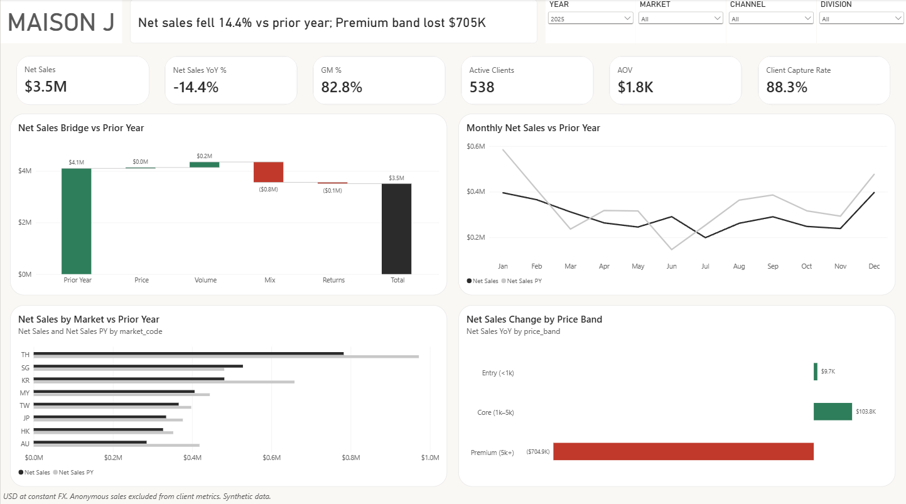

# APAC Luxury Retail Performance Analysis (Power BI)

Why did a luxury house's APAC net sales fall 14.4% in 2025 after four years of growth, and what should it do about it?

This project is an end to end Power BI build on a synthetic dataset for a fictional luxury maison (8 markets, 16 boutiques plus e-commerce, 2021 to 2025). It covers data modelling, DAX, report design, testing and a set of costed recommendations.



## Key findings (2025 vs 2024)

| Question | Finding |
| --- | --- |
| What happened | Net sales fell 14.4% (USD 4.10M to 3.51M) while transactions rose 3% and active clients rose from 513 to 538 |
| Why | Price was flat and volume grew USD 0.2M; mix cost USD 0.8M. Clients kept buying but bought cheaper |
| Where in the range | The Premium band lost USD 705K, more than the total decline. Iconic share fell from 19.7% to 10.3% |
| Who | The top 15 clients of 2024 cut spend by a net USD 373K, 63% of the decline. Retention fell from 52.0% to 48.5% |
| Where in the network | 11 of 17 stores declined. Sydney Castlereagh fell 56.7% with the lowest sales attribution (84%) |
| Stock | Siam Paragon holds 12 weeks of cover while Taipei 101 and Breeze Nanshan hold 61 to 71 |

The Actions page turns these into five owned recommendations with an estimated size of prize.

## Report pages

1. **Executive Summary**: price, volume, mix bridge and headline KPIs
2. **Market and Store**: store matrix, decomposition tree, metric and dimension selectors
3. **Category and Product**: division mix, price band change, premium and iconic share, price vs volume
4. **Client and CRM**: client movement, cohort retention, tier contribution, top client spend change
5. **Advisor Productivity**: productivity vs client capture quadrants, attribution, book coverage, orphaned clients
6. **Inventory**: weeks of cover heatmap, stock vs demand, sell through, aged stock
7. **Actions**: five recommendations with evidence, size of prize and owner
8. **Store 360 and Client 360**: drillthrough pages (right click any store or client)
9. **QA** (hidden): 11 automated reconciliation tests, all passing

## Technical highlights

- **Star schema to fact constellation**: fact_sales with five conformed dimensions, plus inventory and target facts
- **Calculation group** for time intelligence (CY, PY, YoY, YoY %, YTD, PYTD, R12M) instead of dozens of duplicate measures
- **Field parameters** so one visual answers any metric by any dimension
- **Price, volume, mix decomposition** that reconciles exactly to the net sales change (tested)
- **Virtual relationships** with TREATAS and LOOKUPVALUE for advisor books and preferred stores, keeping the model free of ambiguous paths
- **Semi additive stock measures** using closing snapshots rather than sums over time
- **Dynamic client tiering** from a disconnected band table, reconciled against the stored tier
- **Data quality handled visibly**: anonymous sales, shared POS logins, orphaned clients and source type issues are surfaced as KPIs, not hidden
- **In model QA page** with PASS or FAIL tests on row counts, totals, the PVM bridge, tier reconciliation and inventory integrity

## Data

All names and figures are synthetic and do not describe any real company.

- `luxury_retail_star_schema.xlsx`: source star schema (sales, clients, products, staff, stores, dates)
- `luxury_retail_extensions.xlsx`: generated month end inventory snapshot. The source had no stock data, so `python/generate_inventory.py` builds one that reconciles exactly to sales (units sold match fact_sales; no negative stock). The generator was written with AI assistance.
- Sales targets are built in Power Query as prior year actual times an assumed growth rate.

Conclusions that rely on inventory and targets illustrate the method rather than a real business.

## How to open

1. Clone the repo and open `pbip/Linkedin Case Study.pbip` in Power BI Desktop.
2. Go to Home > Transform data > Manage Parameters and set:
   - `SourcePath`: full path to `data/luxury_retail_star_schema.xlsx`
   - `ExtensionPath`: full path to `data/luxury_retail_extensions.xlsx`
3. Refresh. The hidden QA page should read 11 of 11 tests passed.

## Repository structure

```
/data        source and extension workbooks
/python      generate_inventory.py
/pbip        Power BI project (TMDL model and report definition)
/docs        technical specification, theme JSON, screenshots
```

## Documentation

The full technical specification (data quality log, model, measure dictionary, page specifications, tests and limitations) is in `/docs`.

## Author

Jerome Tan, Singapore. BI Analyst, Retail Performance and Client Analytics (APAC Luxury).
